# The Fatigue-Aware Slow Travel Agent

An Agentic AI System for Comfort-Optimized Itineraries

<div class="absolute bottom-10 right-10 text-sm opacity-75">
  Team 405
</div>


<!--
Good morning/afternoon everyone. Today we'll be presenting our project proposal: The Fatigue-Aware Slow Travel Agent — an agentic AI system designed to optimize travel itineraries not for speed, but for physical comfort and experience quality. This project is powered by three key technologies: LangGraph for the agent framework, Browser-use for real-time web data, and the Amap API for geolocation services.
-->

---
layout: intro
---

# **Outline**

- ## **Introduction** — Problem & Motivation
- ## **Objectives** — What We Aim to Build
- ## **Research Plan** — Tasks & Methodology
- ## **Timeline** — 10-Week Delivery Schedule
- ## **References** — Key Literature & Tools

<!--
Here's the roadmap for today's presentation. We'll start with the problem we're trying to solve, then walk through our objectives, the detailed research plan broken into four tasks, our 10-week timeline, and finally the references that ground this work.
-->

---
layout: section
---

# Introduction

Problem Background & Motivation

<!--
Let's begin with the problem background and what motivated this project.
-->

---
layout: two-cols-header
---

# "Special Forces Tourism"

::left::

### The Problem

- Post-pandemic trend: **maximize attractions** in minimal time
- Leads to **physical exhaustion** and superficial engagement
- Contradicts **Slow Travel** principles — pacing, sustainability, deep connection

::right::

### Traditional TRS Limitations

- Optimize solely for **distance or popularity**
- Ignore traveler's **real-time physical state**
- No awareness of **fatigue accumulation**

<!--
After the pandemic, a trend called "Special Forces Tourism" emerged — travelers try to visit as many attractions as possible in the shortest time. While time-efficient, this leads to exhaustion and very shallow cultural engagement. It goes against the philosophy of Slow Travel, which values pacing, sustainability, and meaningful connection with local environments.

On the technical side, traditional travel recommendation systems only optimize for distance or popularity. They have no concept of how tired the traveler actually is. There's no fatigue tracking, no adaptive re-planning — just a static list of places ordered by proximity.
-->

---
layout: two-cols-header
---

# Why LLM-Powered Agents?

::left::

### Static Algorithms vs. Autonomous Agents

| Aspect | Traditional TRS | LLM Agent |
|--------|----------------|-----------|
| Planning | Fixed rules | Adaptive reasoning |
| State | Stateless | Stateful memory |
| Tools | Single data source | Multi-modal tools |
| Recovery | Fails on errors | Self-corrects |

::right::

### Key Enablers

- **ReAct Framework** — Reasoning + Acting in LLMs
- **LangGraph** — Stateful, cyclic graph workflows
- **Browser-use** — CV-based web browsing for real-time data
- **Amap API** — Precise geocoding & route planning

<!--
So why use LLM-powered agents instead of traditional algorithms? The table on the left summarizes the key differences. Traditional systems use fixed rules and are stateless — they can't adapt mid-trip. LLM agents, on the other hand, can reason adaptively, maintain stateful memory of the traveler's condition, use multiple tools simultaneously, and self-correct when things go wrong — like a sold-out ticket or sudden rain.

The four key technologies enabling this are: the ReAct framework for combining reasoning with action, LangGraph for building stateful cyclic workflows, Browser-use for automated web browsing with computer vision, and the Amap API for accurate Chinese map data and route planning.
-->

---

# Our Proposed Solution

A **Slow Travel Planner Agent** that dynamically adjusts itineraries based on fatigue

```mermaid {scale: 0.65}
graph LR
    U["👤 User Input"] --> P["🗺️ Planner Node"]
    P --> F{"🦶 Fatigue Check<br/>steps > 15k?"}
    F -->|No| N["📍 Next Attraction"]
    F -->|Yes| R["☕ Rest Finder Node"]
    R --> P
    N --> T{"🎫 Ticket Available?"}
    T -->|Yes| V["✅ Visit"]
    T -->|No| P
    V --> F
    style F fill:#ffd43b
    style R fill:#51cf66,color:#fff
    style P fill:#339af0,color:#fff
```



> **Core Idea**: Maintain a stateful **fatigue metric** (step count + transit time) and dynamically insert rest nodes when thresholds are exceeded.

<!--
This diagram shows the core loop of our proposed agent. The user provides their preferences, and the Planner Node generates an initial route. Before each next attraction, the Fatigue Monitor checks the cumulative step count. If it exceeds the threshold — say 15,000 steps — instead of pushing to the next attraction, the agent routes to a Rest Finder Node that locates a nearby café or park. After resting, it returns to the planner to continue.

There's also a ticket availability check — if a ticket is sold out, the agent loops back to the planner to pick an alternative. This cyclic, self-correcting behavior is what makes it fundamentally different from a static itinerary.
-->

---
layout: section
---

# Objectives

What We Aim to Build

<!--
Now let us outline the four specific objectives of this project. Our primary goal is to build an Agentic AI system that optimizes travel itineraries for physical comfort and experience quality, rather than just speed.
-->

---
layout: two-cols-header
---

# Objectives

::left::

### 🎯 Obj 1: Fatigue-Adaptive Logic

Implement a state-machine workflow that tracks **cumulative walking distance** and triggers **rest interventions** when thresholds (e.g., 15,000 steps) are exceeded.

### 🔧 Obj 2: Multi-Modal Tool Usage

Synergize **structured geolocation data** (Amap API) with **unstructured web data** (real-time ticket availability & crowd forecasts via Browser-use).

::right::

### 🔄 Obj 3: Cyclic Planning with LangGraph

Move beyond linear chains → create a **cyclic graph architecture** enabling self-correction and iterative re-planning based on environmental feedback.

### 🖥️ Obj 4: Human-Centric Interface

Deploy a **Streamlit UI** that visualizes the "slow travel" logic, showing users **where and why** rest stops were added.

<!--
Objective 1 is the fatigue-adaptive logic — the core state machine that monitors cumulative walking distance and triggers rest interventions. We're using 15,000 steps as our initial threshold, which is roughly 10 to 12 kilometers of walking.

Objective 2 is multi-modal tool usage — combining structured data from the Amap API with unstructured data scraped from the web via Browser-use, such as real-time crowd levels and ticket availability.

Objective 3 is about the architecture itself — using LangGraph to build a cyclic graph, not a linear chain. This allows the agent to loop back, re-plan, and self-correct based on real-time feedback.

Objective 4 is the human-centric interface — a Streamlit dashboard that doesn't just show the route, but explicitly visualizes where rest stops were inserted and why the agent made those decisions. Transparency is key.
-->

---
layout: section
---

# Research Plan

Tasks & Methodology

<!--
Let us now walk through the research plan, which is divided into four main tasks.
-->

---
layout: two-cols-header
---

# Task 1: Infrastructure & Tools

::left::

### Subtask 1.1 — Amap API Wrappers

Develop Python modules for:

- **Geocoding** — Address ↔ Coordinates
- **Walking Route Planning** — Distance & step estimation
- **Traffic Status** — Real-time congestion data

```python {all}{maxHeight:'120px'}
import requests

class AmapClient:
    BASE = "https://restapi.amap.com/v3"

    def geocode(self, address: str):
        return requests.get(
            f"{self.BASE}/geocode/geo",
            params={"address": address,
                    "key": self.api_key}
        ).json()

    def walking_route(self, origin, dest):
        return requests.get(
            f"{self.BASE}/direction/walking",
            params={"origin": origin,
                    "destination": dest,
                    "key": self.api_key}
        ).json()
```

::right::

### Subtask 1.2 — Browser-use Integration

Automate unstructured data retrieval with a Vision-Language Model:

- Parse **weather warnings** from weather sites
- Check **ticket availability** on scenic spot websites
- Assess **real-time crowd levels** from live feeds
- Powered by **GPT-4o / Gemini** vision capabilities

```mermaid {scale: 0.7}
graph TD
    B["🌐 Browser-use"] --> W["Weather Data"]
    B --> T["Ticket Status"]
    B --> C["Crowd Levels"]
    V["👁️ VLM (GPT-4o)"] --> B
    style B fill:#339af0,color:#fff
    style V fill:#7950f2,color:#fff
```



<!--
Task 1 is about building the foundational tools. On the left, Subtask 1.1 involves writing Python wrappers around the Amap Web Service API. We need three main functions: geocoding to convert addresses to coordinates, walking route planning to estimate distances and step counts, and traffic status queries. You can see a simplified version of the client class here.

On the right, Subtask 1.2 is the Browser-use integration. This uses a vision-language model like GPT-4o to automate web browsing — the agent can navigate to a scenic spot's website, read whether tickets are available, check weather warnings, or even assess crowd density from live camera feeds. This is the "eyes" of our agent.
-->

---

# Task 2: Agent Architecture (LangGraph)

### Subtask 2.1 — AgentState Schema

```python
from typing import TypedDict, List, Optional

class AgentState(TypedDict):
    user_itinerary: List[dict]       # Ordered list of POIs
    current_step_count: int          # Cumulative steps
    fatigue_level: float             # Normalized 0.0 - 1.0
    weather_constraints: Optional[str]
    current_location: tuple          # (lat, lng)
    visited: List[str]              # Already visited POIs
    rest_stops_inserted: int        # Count of rest interventions
```

### Subtask 2.2 — Core Node Logic

```mermaid {scale: 0.6}
graph LR
    Start["🚀 Start"] --> Planner["Planner Node<br/>(Route Generation)"]
    Planner --> Monitor{"Fatigue Monitor<br/>steps > threshold?"}
    Monitor -->|Yes| Rest["☕ Coffee/Rest<br/>Finder Node"]
    Monitor -->|No| Next["Next Attraction"]
    Rest --> Planner
    Next --> Monitor
    style Monitor fill:#ffd43b
    style Rest fill:#51cf66,color:#fff
    style Planner fill:#339af0,color:#fff
```



<!--
Task 2 is the core agent architecture using LangGraph. Subtask 2.1 defines the AgentState schema — this is the shared state that flows through every node in the graph. It tracks the itinerary, cumulative step count, a normalized fatigue level, weather constraints, current location, visited POIs, and how many rest stops have been inserted.

Subtask 2.2 implements the actual node logic. The Planner Node generates or updates the route. The Fatigue Monitor is a conditional node — it checks the step count against the threshold. If exceeded, the workflow routes to the Coffee/Rest Finder node, which searches for nearby rest options using the Amap API. After rest, control loops back to the Planner. This cyclic structure is a key advantage of LangGraph over simple linear chains.
-->

---
layout: two-cols-header
---

# Task 3: Integration & Optimization

::left::

### Subtask 3.1 — Conditional Edges

Key conditional routing logic:

- **Fatigue threshold exceeded** → Route to Rest Finder
- **Ticket sold out** → Return to Planner → Select alternative
- **Bad weather detected** → Swap outdoor → indoor POI
- **All POIs visited** → Generate summary & end

::right::

<div class="ml-4">

### Subtask 3.2 — Prompt Engineering

"Anti-Special Forces" prompting to ensure the LLM:

- Prioritizes **relaxed pacing** over POI count
- Suggests **local experiences** (cafés, parks, markets)
- Respects **daily step budgets**
- Generates **natural rest transitions** (not abrupt stops)

</div>

<!--
Task 3 brings everything together. Subtask 3.1 is about wiring the complete graph with conditional edges. Beyond the fatigue check, we handle sold-out tickets by rerouting to the planner for alternatives, bad weather by swapping outdoor attractions for indoor ones, and a graceful end condition when all POIs are visited.

Subtask 3.2 is what we call "Anti-Special Forces" prompt engineering. We carefully design the system prompts so the LLM prioritizes relaxed pacing, suggests local hidden gems like neighborhood cafés and markets, respects the daily step budget, and creates natural transitions to rest stops — not jarring interruptions. The agent should feel like a thoughtful local friend guiding you, not a robot maximizing efficiency.
-->

---
layout: two-cols-header
---

# Task 4: Evaluation & Interface

::left::

### Subtask 4.1 — Streamlit Dashboard

Visualize the itinerary and fatigue curve:

- 🗺️ **Interactive Map** with route & rest stops
- 📈 **Fatigue Curve** showing energy over time
- 🔄 **Re-planning Events** log
- ⚙️ **User Controls** for threshold tuning

::right::

### Subtask 4.2 — Evaluation Metrics

Compare against standard "greedy" algorithms:

| Metric | Greedy | Our Agent |
|--------|--------|-----------|
| Avg. Daily Steps | ~25,000 | ≤15,000 |
| Rest Stops / Day | 0-1 | 3-5 |
| Re-planning Rate | 0% | Dynamic |
| User Fatigue Score | High | Low |

<!--
Task 4 covers evaluation and the user interface. The Streamlit dashboard will show an interactive map with the route and rest stops clearly marked, a fatigue curve graph showing energy levels throughout the day, a log of all re-planning events so users can see the agent's decision-making, and controls to adjust the fatigue threshold.

For evaluation, we'll run simulation tests comparing our agent against a standard greedy algorithm that just picks the nearest unvisited attraction. We expect to see daily steps reduced from around 25,000 to under 15,000, rest stops increasing from near zero to 3-5 per day, and overall fatigue scores dropping significantly. The re-planning rate is dynamic — it activates only when conditions require it.
-->

---
layout: section
---

# Timeline

10-Week Delivery Schedule

<!--
Let us now show you our delivery timeline.
-->

---

# Project Timeline

| Week | Task | Deliverable |
|------|------|-------------|
| 1-2 | Theoretical Framework | Background Research  & Architecture Diagram |
| 3-4 | Tool Implementation | Functional Amap API & Browser-use modules |
| 5-6 | Core Agent Development | Working "Fatigue Monitoring" prototype |
| 7-8 | Integration & UI | Streamlit Web App v1.0 |
| 9 | Testing & Refinement | Performance Report |
| 10 | Final Submission | Project Report & Presentation Deck |

<!--
The project spans 10 weeks. Weeks 1-2 focus on the background research and designing the LangGraph architecture diagram. Weeks 3-4 are for implementing the Amap API wrappers and Browser-use modules — the tools the agent will use. Weeks 5-6 are dedicated to the core agent development, specifically getting the fatigue monitoring logic working as a prototype. Weeks 7-8 integrate everything and build the Streamlit web interface. Week 9 is for testing, running comparison experiments against the greedy baseline, and refinement. Week 10 is final submission — the project report and this presentation deck.
-->

---
layout: section
---

# References

Key Literature & Tools

<!--
Finally, here are the key references that support this project.
-->

---

# References

<div class="text-sm">

**Slow Travel & Tourism**

1. Cheer, J. M., Milano, C., & Novelli, M. (2019). Tourism and community resilience in the Anthropocene. *J. Sustainable Tourism*, 27(4), 554-572.
2. Dickinson, J. E., Lumsdon, L. M., & Robbins, D. (2011). Slow travel: Issues for tourism and climate change. *J. Sustainable Tourism*, 19(3), 281-302.
3. Lim, K. H., et al. (2019). Tour recommendation and itinerary planning: A survey. *AI Review*, 52, 405-439.

**LLM Agents & Frameworks**

4. Xi, Z., et al. (2023). The Rise and Potential of LLM Based Agents: A Survey. *arXiv:2309.07864*.
5. Schick, T., et al. (2023). Toolformer: Language Models Can Teach Themselves to Use Tools. *arXiv:2302.04761*.
6. Yao, S., et al. (2023). ReAct: Synergizing Reasoning and Acting in LLMs. *ICLR*.

**Tools & Planning**

7. LangChain AI. (2024). LangGraph. https://langchain-ai.github.io/langgraph/
8. Browser-use. (2025). https://github.com/browser-use/browser-use
9. AutoNavi. (2025). Amap Web Service API. https://lbs.amap.com/api/webservice/summary/

</div>


---
layout: center
class: text-center
---

# Thank You

Questions & Discussion

<!--
That concludes our presentation. Thank you for your attention. We're happy to take any questions about the architecture, the fatigue model, or any other aspect of the project.
-->