# The Fatigue-Aware Slow Travel Agent

An Agentic AI System for Comfort-Optimized Itineraries

---
layout: intro
---

# **Outline**

- ## **Introduction** — Problem & Motivation
- ## **Objectives** — What We Aim to Build
- ## **Research Plan** — Tasks & Methodology
- ## **Timeline** — 10-Week Delivery Schedule
- ## **References** — Key Literature & Tools

---
layout: section
---

# Introduction

Problem Background & Motivation

---
layout: two-cols-header
---

# "Special Forces Tourism"

::left::

### The Problem

- Post-pandemic trend: **maximize attractions** in minimal time
- Leads to **physical exhaustion** and superficial engagement
- Contradicts **Slow Travel** principles — pacing, sustainability, deep connection

::right::

### Traditional TRS Limitations

- Optimize solely for **distance or popularity**
- Ignore traveler's **real-time physical state**
- No awareness of **fatigue accumulation**

---
layout: two-cols-header
---

# Why LLM-Powered Agents?

::left::

### Static Algorithms vs. Autonomous Agents

| Aspect | Traditional TRS | LLM Agent |
|--------|----------------|-----------|
| Planning | Fixed rules | Adaptive reasoning |
| State | Stateless | Stateful memory |
| Tools | Single data source | Multi-modal tools |
| Recovery | Fails on errors | Self-corrects |

::right::

### Key Enablers

- **ReAct Framework** — Reasoning + Acting in LLMs
- **LangGraph** — Stateful, cyclic graph workflows
- **Browser-use** — CV-based web browsing for real-time data
- **Amap API** — Precise geocoding & route planning

---

# Our Proposed Solution

A **Slow Travel Planner Agent** that dynamically adjusts itineraries based on fatigue

```mermaid {scale: 0.65}
graph LR
    U["👤 User Input"] --> P["🗺️ Planner Node"]
    P --> F{"🦶 Fatigue Check<br/>steps > 15k?"}
    F -->|No| N["📍 Next Attraction"]
    F -->|Yes| R["☕ Rest Finder Node"]
    R --> P
    N --> T{"🎫 Ticket Available?"}
    T -->|Yes| V["✅ Visit"]
    T -->|No| P
    V --> F
    style F fill:#ffd43b
    style R fill:#51cf66,color:#fff
    style P fill:#339af0,color:#fff
```



> **Core Idea**: Maintain a stateful **fatigue metric** (step count + transit time) and dynamically insert rest nodes when thresholds are exceeded.

---
layout: section
---

# Objectives

What We Aim to Build

---
layout: two-cols-header
---

# Objectives

::left::

### 🎯 Obj 1: Fatigue-Adaptive Logic

Implement a state-machine workflow that tracks **cumulative walking distance** and triggers **rest interventions** when thresholds (e.g., 15,000 steps) are exceeded.

### 🔧 Obj 2: Multi-Modal Tool Usage

Synergize **structured geolocation data** (Amap API) with **unstructured web data** (real-time ticket availability & crowd forecasts via Browser-use).

::right::

### 🔄 Obj 3: Cyclic Planning with LangGraph

Move beyond linear chains → create a **cyclic graph architecture** enabling self-correction and iterative re-planning based on environmental feedback.

### 🖥️ Obj 4: Human-Centric Interface

Deploy a **Streamlit UI** that visualizes the "slow travel" logic, showing users **where and why** rest stops were added.

---
layout: section
---

# Research Plan

Tasks & Methodology

---
layout: two-cols-header
---

# Task 1: Infrastructure & Tools

::left::

### Subtask 1.1 — Amap API Wrappers

Develop Python modules for:

- **Geocoding** — Address ↔ Coordinates
- **Walking Route Planning** — Distance & step estimation
- **Traffic Status** — Real-time congestion data

```python {all}{maxHeight:'120px'}
import requests

class AmapClient:
    BASE = "https://restapi.amap.com/v3"

    def geocode(self, address: str):
        return requests.get(
            f"{self.BASE}/geocode/geo",
            params={"address": address,
                    "key": self.api_key}
        ).json()

    def walking_route(self, origin, dest):
        return requests.get(
            f"{self.BASE}/direction/walking",
            params={"origin": origin,
                    "destination": dest,
                    "key": self.api_key}
        ).json()
```

::right::

### Subtask 1.2 — Browser-use Integration

Automate unstructured data retrieval with a Vision-Language Model:

- Parse **weather warnings** from weather sites
- Check **ticket availability** on scenic spot websites
- Assess **real-time crowd levels** from live feeds
- Powered by **GPT-4o / Gemini** vision capabilities

```mermaid {scale: 0.7}
graph TD
    B["🌐 Browser-use"] --> W["Weather Data"]
    B --> T["Ticket Status"]
    B --> C["Crowd Levels"]
    V["👁️ VLM (GPT-4o)"] --> B
    style B fill:#339af0,color:#fff
    style V fill:#7950f2,color:#fff
```



---

# Task 2: Agent Architecture (LangGraph)

### Subtask 2.1 — AgentState Schema

```python
from typing import TypedDict, List, Optional

class AgentState(TypedDict):
    user_itinerary: List[dict]       # Ordered list of POIs
    current_step_count: int          # Cumulative steps
    fatigue_level: float             # Normalized 0.0 - 1.0
    weather_constraints: Optional[str]
    current_location: tuple          # (lat, lng)
    visited: List[str]              # Already visited POIs
    rest_stops_inserted: int        # Count of rest interventions
```

### Subtask 2.2 — Core Node Logic

```mermaid {scale: 0.6}
graph LR
    Start["🚀 Start"] --> Planner["Planner Node<br/>(Route Generation)"]
    Planner --> Monitor{"Fatigue Monitor<br/>steps > threshold?"}
    Monitor -->|Yes| Rest["☕ Coffee/Rest<br/>Finder Node"]
    Monitor -->|No| Next["Next Attraction"]
    Rest --> Planner
    Next --> Monitor
    style Monitor fill:#ffd43b
    style Rest fill:#51cf66,color:#fff
    style Planner fill:#339af0,color:#fff
```



---
layout: two-cols-header
---

# Task 3: Integration & Optimization

::left::

### Subtask 3.1 — Conditional Edges

Key conditional routing logic:

- **Fatigue threshold exceeded** → Route to Rest Finder
- **Ticket sold out** → Return to Planner → Select alternative
- **Bad weather detected** → Swap outdoor → indoor POI
- **All POIs visited** → Generate summary & end

::right::

<div class="ml-4">

### Subtask 3.2 — Prompt Engineering

"Anti-Special Forces" prompting to ensure the LLM:

- Prioritizes **relaxed pacing** over POI count
- Suggests **local experiences** (cafés, parks, markets)
- Respects **daily step budgets**
- Generates **natural rest transitions** (not abrupt stops)

</div>

---
layout: two-cols-header
---

# Task 4: Evaluation & Interface

::left::

### Subtask 4.1 — Streamlit Dashboard

Visualize the itinerary and fatigue curve:

- 🗺️ **Interactive Map** with route & rest stops
- 📈 **Fatigue Curve** showing energy over time
- 🔄 **Re-planning Events** log
- ⚙️ **User Controls** for threshold tuning

::right::

### Subtask 4.2 — Evaluation Metrics

Compare against standard "greedy" algorithms:

| Metric | Greedy | Our Agent |
|--------|--------|-----------|
| Avg. Daily Steps | ~25,000 | ≤15,000 |
| Rest Stops / Day | 0-1 | 3-5 |
| Re-planning Rate | 0% | Dynamic |
| User Fatigue Score | High | Low |

---
layout: section
---

# Timeline

10-Week Delivery Schedule

---

# Project Timeline

| Week | Task | Deliverable |
|------|------|-------------|
| 1-2 | Theoretical Framework | Literature Review & Architecture Diagram |
| 3-4 | Tool Implementation | Functional Amap API & Browser-use modules |
| 5-6 | Core Agent Development | Working "Fatigue Monitoring" prototype |
| 7-8 | Integration & UI | Streamlit Web App v1.0 |
| 9 | Testing & Refinement | Performance Report |
| 10 | Final Submission | Project Report & Presentation Deck |

---
layout: section
---

# References

Key Literature & Tools

---

# References

<div class="text-sm">

**Slow Travel & Tourism**

1. Cheer, J. M., Milano, C., & Novelli, M. (2019). Tourism and community resilience in the Anthropocene. *J. Sustainable Tourism*, 27(4), 554-572.
2. Dickinson, J. E., Lumsdon, L. M., & Robbins, D. (2011). Slow travel: Issues for tourism and climate change. *J. Sustainable Tourism*, 19(3), 281-302.
3. Lim, K. H., et al. (2019). Tour recommendation and itinerary planning: A survey. *AI Review*, 52, 405-439.

**LLM Agents & Frameworks**

4. Xi, Z., et al. (2023). The Rise and Potential of LLM Based Agents: A Survey. *arXiv:2309.07864*.
5. Schick, T., et al. (2023). Toolformer: Language Models Can Teach Themselves to Use Tools. *arXiv:2302.04761*.
6. Yao, S., et al. (2023). ReAct: Synergizing Reasoning and Acting in LLMs. *ICLR*.

**Tools & Planning**

7. LangChain AI. (2024). LangGraph. https://langchain-ai.github.io/langgraph/
8. Browser-use. (2025). https://github.com/browser-use/browser-use
9. AutoNavi. (2025). Amap Web Service API. https://lbs.amap.com/api/webservice/summary/

</div>

---
layout: center
class: text-center
---

# Thank You

Questions & Discussion